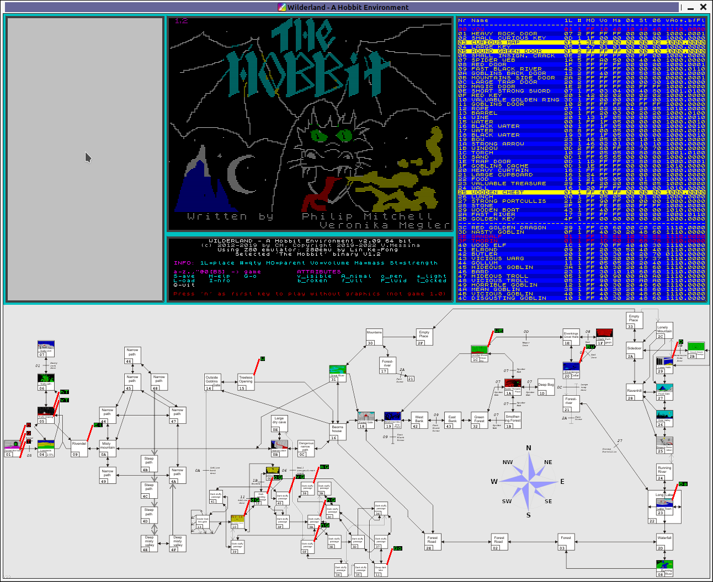
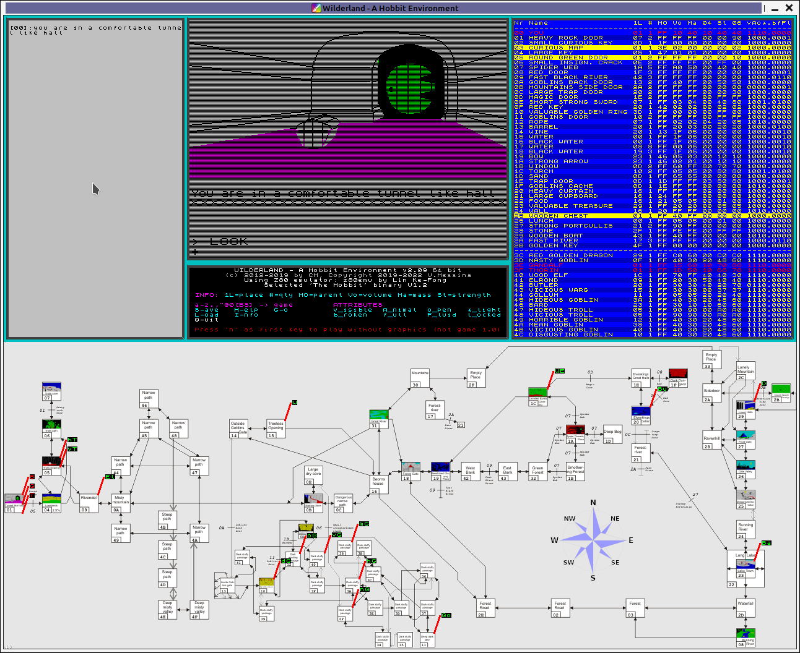

                                  WILDERLAND

                             A Hobbit Environment

                            (c) 2012-2019 by CH
                    (c) Copyright 2019-2023 Valerio Messina

                            wilderland AT aonDOTat
                               efa AT iol DOT it




CONTENT
=======

* (0) Legal Info
* (1) Introduction
* (2) Game Versions
* (3) Installing WL
* (4) Obtaining The Game Files
* (5) Starting 'Wilderland'
* (6) Controlling 'Wilderland'
* (7) The Objects
* (8) References


(0) - Legal Info
================

WILDERLAND is (c) 2012 by CH, Copyright 2019-2023 Valerio Messina.
   You may use/modify it for private use; if you
   want to distribute a program based on WILDERLAND, please contact the authors
   at wilderland AT aonDOTat, efa AT iol DOT it

"The Hobbit" is (c) Melbourne House, 1982. Written by Veronika Megler and
   Philip Mitchell.

Simple DirectMedia Layer library (SDL 2.0) from www.libsdl.org (zlib license).

z80emu emulator based on Lin Ke-Fong free work
   (http://github.com/anotherlin/z80emu)

Z80 emulator based on Marat Fayzullin's work from 2007. Free for non-profit
   projects (http://fms.komkon.org).

8x8 charset from ZX Spectrum ROM (c) by Amstrad; use granted for emulators.

Makefiles for GCC and GNUtool-chain was written by Valerio Messina
Makefile to cross-compile for Win32/64 and macOS64 written by Valerio Messina
Porting to SDL2.0 was made by Valerio Messina (efa AT iol DOT it)
Support for selectable Z80 emulator by Valerio Messina (efa AT iol DOT it)

YOU ARE NOT ALLOWED TO DISTRIBUTE 'WILDERLAND' TOGETHER WITH HOBBIT BINARIES!


(1) - Introduction
==================

WILDERLAND (WL) allows you to see what's REALLY going on in this wonderful
world created by Veronika Megler and Philip Mitchell in 1982 at Melbourne
House. It runs the original game code in a rudimentary Spectrum emulator,
while displaying the state of objects and animals, the current positions of
the latter, and a log what all the other creatures (NPC) do while Bilbo is
in one place.


(2) - Game Versions
===================
According to an interview with Philip Mitchell [1] there have been two
published versions of "The Hobbit": the initial realease (called V 1.1 for
'vanity' reasons) and a bug-fixed V 1.2, that are easy to identify through the
authors' names in the loading screen. Both of these games are available for
download on the 'World of Spectrum' web site [2], though they are referenced
as V 1.0 and V 1.2 there.
The main research object for the author of 'Wilderland' was his own tape
version of the game transfered to PC sometimes in the 90ies. With the original
tape long gone, it can't be reconstructed, which version this should have been.
BUT IT IS CLEAR THAT IT IS NEITHER V 1.0 (1.1) NOR V 1.2. The code differs in
a number of aspects from both. Some facts indicate that this so called 'Version
OWN' was released between V 1.0 (1.1) and V 1.2, though this has to be
researched more thoroughly at a later time.

The following game versions are supported in WL:

* V 1.0 (1.1)
* V OWN
* V 1.2


(3) - Installing WL
===================

(3.1) - Windows

Just unzip all files to a directory. The package includes the source files
and a compiled version of WL. There are also a number of support files (loading
screen, high-res map, graphics DLL etc.) included.

WL was developed with 'Pelles C for Windows, V 6.50.8', Simple Direct Media
Layer library (SDL 1.2) from www.libsdl.org (GNU licence) and a Z80 emulator
based on Marat Fayzullin's work from 2007 (fms.komkon.org) under Windows XP.


(3.2) - Linux/macOS

In 2019 Valerio Messina (efa AT iol DOT it) from Italy ported WL to Linux.
The files are available on the Wilderland homepage, too. A binary for macOS 64
bit is also available. The package includes source files and compiled versions:
* 'WL'          Linux64 binary built with GCC 10.2.1 on Linux64
* 'WL32'        Linux32 binary built with GCC 10.2.1 on Linux64
* 'WLmgw.exe'   Win64 binary built with MinGW/MSYS2 [3] on Win64
* 'WLmgw32.exe' Win32 binary built with MinGW/MSYS2 [3] on Win64
* 'WLmxe.exe'   Win64 binary cross-built with MXE.static [4] link on Linux64
* 'WLmxe32.exe' Win32 binary cross-built with MXE.static [4] link on Linux64
* 'WLpc.exe'    Win32 binary built with Pelles C/LCC on Win32
* 'WLosx'       macOS64 binary cross-built with OSXcross/CLang/LLVM [5] on Linux

Just unzip all files to a directory. On macOS the standard Wilderland.dmg file
can be installed opening it and dragging to Applications.

The sources was ported to SDLv2.0, added the support for a free Z80 emulator:
'z80emu' by Lin Ke-Fong [6] now the default, and some improvements, see
Changelog.txt

To build sources on Linux, install dependencies with:

```$ sudo apt install build-essential libsdl2-dev libsdl2-image-dev```

then just run ```make```.

To buid @32bit on 64 bit Linux use ```make -f Makefile32```, this require:

```$ sudo apt install build-essential libsdl2-dev:i386 libsdl2-image-dev:i386```

On Windows you can build a native Win version using MinGW/MSYS2 [3]:

To build for Win64 on Win use: ```make -f MakefileG64```

To build for Win32 on Win use: ```make -f MakefileG32```

Makefiles for cross-compilation from Linux are also provided:

To build for Win64 on Linux use: ```make -f MakefileM64```, require [4]

To build for Win32 on Linux use: ```make -f MakefileM32```, require [4]

To build for macOS64 on Linux use:```make -f MakefileO64```, require [5]

On all builds, you can select the CPU emulator to be used with:

```
$ make CPUEMUL=ez80emu   OR   $ make    # to use 'z80emu' emulator
$ make CPUEMUL=eZ80                     # to use 'Z80'    emulator
```

To create the distribution packages:
```
$ make rel  # to generate the release package
$ WLpkg PKG # to package the built files
            # PKG can be LIN32,LIN64,MGW32,MGW64,MXE32,MXE64,OSX64
$ WLrel     # to generate the release packages for all target platforms
```


(4) - Obtaining the game files
==============================
The actual game files (ZX Spectrum binaries) you need to run WL are NOT
included in the WL download package for copyright reasons. You may get
them from various abandonware websites like 'World of Spectrum' [2].
I hereby explicitly prohibit the distribution of 'Wilderland' together with
the Hobbit binaries!

Step-by-Step-Instruction:
*  (4.1) Go to http://www.worldofspectrum.org
*  (4.2) Select 'Archive' - 'Text Adventures' - 'TOGGLE FILTER' -
         in Title type 'Hobbit' - select 'The Hobbit' Melbourne House 1982
*  (4.3) Expand Files section, download:
         'HobbitTheV1.2.tap.zip', 'HobbitTheV1.0.tap.zip',
         'HobbitTheV1.2.tzx.zip' or 'HobbitTheV1.0.tzx.zip'
*  (4.4) Unzip the downloaded file, put 'HOBBIT12.TAP', 'HOBBIT.TAP',
         'The Hobbit v1.2.tzx' or 'The Hobbit v1.0.tzx' file into the
         Wilderland directory.

Optionally you can generate the binary file stripping the tape headers:
*  (4.5) Unzip the 'HOBBIT12.TAP', 'HOBBIT.TAP', 'The Hobbit v1.2.tzx' or
         'The Hobbit v1.0.tzx' file into the 'TapCon' directory.
*  (4.6) Run 'TapCon' or 'TapCon.exe' to extract the game binaries.
*  (4.7) Copy 'HOB_V12.bin' or 'HOB_V10.bin' to the WL directory.


(5) - Starting 'Wilderland'
===========================
Run WL from the command line with the following command:
```
   WL [-V10|-OWN|-V12] [-FULLSCREEN|FIT|MAP] [-MAXSPEED] [-NOSCANLINES] [-SEEDRND]
   WL [-HELP]
```
* '-V10', '-OWN' or '-V12' selects the game version (if binary is available)
   when no version is selected, Wilderland start with V12
* -FULLSCREEN runs the game in fullscreen mode (only recommended for screens
   with 1280 x 1024 pixel native resolution)
* -FIT runs the game in desktop resolution mode
* -MAP runs the game with map undocked and sized 1870x725 (for fullHD)
* -MAXSPEED runs the emulator with maximum speed (useful if you just want to
   see the NPCs roam around). Otherwise the Spectrum speed with an approximate
   30 seconds wait cycle is emulated.
* -NOSCANLINES suppresses the TV-like scanlines in the game window (less
   authentic but better for the eye!).
* -SEEDRND. The game uses the Z80 processor's refresh register to generate
   random numbers. With this option this register is initialized to an
   arbitrary value to make game play more unpredictable.


(6) - Controlling 'Wilderland'
==============================
The 'Wilderland' screen is divided into a number of different windows



with the following layout:

                    +--------+----------------+-----------+
                    |        |                |           |
                    |        |      Game      |           |
                    |  Log   |     Window     | Attribute |
                    | Window |                |  Window   |
                    |        +----------------+           |
                    |        | Command Window |           |
                    +--------+----------------+-----------+
                    |                                     |
                    |                                     |
                    |             Map Window              |
                    |                                     |
                    |                                     |
                    +-------------------------------------+

* Log Window: shows what's going on in the 'background' of the game (e.g. what
   the NPC do in their respective rooms) [7].
* Game Window: this is an exact representation of the Spectrum's screen while
   the game is running.
* Command Window: this is Wilderland's command window. Help information is
   displayed within or filenames for load/save commands can be entered.
* Attribute Window: the state of all objects (and NPC [including you] which
   are also objects in the game's context) is displayed here. See section
   "(7) - The Objects" for a full reference.
* Map Window: the position of all the NPC is indicated in this game map (a
   high-res version for print-out can be found in the 'Design' directory of
   WL). Dead NPC have an additional '+' attached to their names.


When running WL you control two different environments:
* the game itself and
* the emulator.

!!!      THE BASIC PRINCIPLE IS THE FOLLOWING: JUST TYPING GOES TO      !!!
!!!      THE GAME, WHILE CAPS-SHIFTED LETTERS CONTROL THE EMULATOR.     !!!


(6.1) - Game Control

* a-z ............... these letters appear in the game's input line
* . and , ........... full stop and comma are also used for input
* " ................. is used to talk to NPC in direct speech
* 0 and BACKSPACE ... are the single char DELETE keys for the game
* @ ................. is the 'do-the-last-command-again' key

The cursor keys can be used for walking like N,S,E,W, and Shift+0 for
clearing the whole input line.


(6.2) - Environment Control

* H ... Help - A short overview of commands, abbreviations and object/NPC
        properties and attributes
* I ... Info - Legal infos on the software are displayed
* S ... Save - Saves the current state of the game in a .wls format.
        Valid characters are: a-z, 0-9, '.', '-' and '_'
* L ... Load - Loads a previous saved game WilderLandShapshot .wls file
        Filename editing is possible in SAVE and LOAD. If you mistyped, just
        press BACKSPACE, a '?' overwrite the wrong char then start again.
        Be sure to load only V10 games into WL if the emulator is running in
        V10-mode (the same applies to V12 of course). Snapshot files from
        different CPU emulators are incompatible too.
* G ... Go - Jump directly to a specific room. Enter number in hex and press
        enter (editing is possible). See the map in the \Design directory for
        a reference on room numbers. This 'beaming' transports you and the
        objects you are holding to the new room, so this is a CHEAT!
* Q ... Quit - Quits the emulator. If the console window stays on the screen,
        press another key to close it too.


(7) - The Objects
=================
The object database is (beside the room and dictionary database) one of the
core items of the game. The following information is stored for each object:
```
* Object Number: the game's internal object reference number (NPCs are >= 60d).
* Name: the object's full name (a noun and a maximum of two adjectives).
* 1L (first location): most objects do only appear in one location, which is
     referenced here as room number (see game map). Some objectes (eg. doors)
     are visible from more than one room, in these cases only the first room is
     indicated.
* #  (number of): how many times the object appears in the game.
* MO (mother object): if an object is carried or enclosed within another object
     this object is referenced by its object number (or 0xFF if this is not the
     case).
* Vo (volume): the object's volume.
* Ma (mass): the object's mass.
* 04 (property with offset +04): currently unknown
* St (strength): the NPC/object's strength (eg. used in fighting)
* 06 (property with offset +06): currently unknown
```
Attributes, each object has 8 binary attributes associated with it:
```
* v: visible
* A: animal (otherwise it is an object)
* o: open (otherwise it is closed)
* *: gives light
* b: broken (or dead for NPC)
* f: full
* F: it is a fluid (water, wine)
* l: locked
```


(8) - References
================
* [1] https://www.otherminds.net/downloads/other-hands/other-hands-issue-18.pdf/
         @@download/file/Other%20Hands%20Issue%20#18.pdf  (page 5-6)
      http://www.avventuretestuali.com/interviste/megler-eng
* [2] http://www.worldofspectrum.org
* [3] https://en.wikipedia.org/wiki/Mingw-w64
      https://www.mingw-w64.org/
      https://www.msys2.org/
* [4] https://mxe.cc/
      https://github.com/mxe/mxe
* [5] https://github.com/tpoechtrager/osxcross
      https://en.wikipedia.org/wiki/Clang
* [6] https://github.com/anotherlin/z80emu
* [7] I haven't found out yet, where the spaces go missing... ;-)
      but you can G-o where the space misses


README.txt Version 2.10b - 20230125
